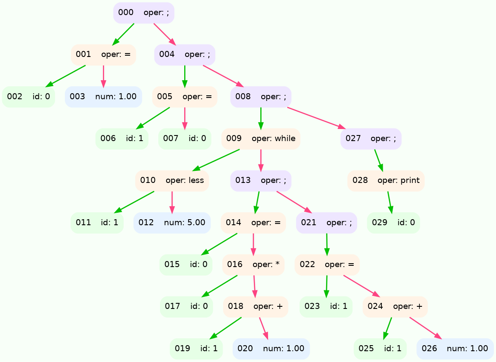

# Краткий обзор
В этом проекте ставилась цель придумать свой Тьюринг-полный язык программирования, написать компилятор в ассемблер нашего виртуального [процессора](https://github.com/asssh52/processor).

## Основные компоненты компилятора

1. **Frontend**, обрабатывает файл с текстом пользователя, возвращает файл в виде AST(Abstruct Syntax Tree)-дерева, состоит из:
    + **Токенайзера** - обрабатывает отдельные слова, числа, операторы.
    + **Лексического анализатора** с рекурсивным спуском - проверяет введённый пользователем текст на корректность по грамматике языка и выдаёт ошибку в случае несоответствия.
2. **Middleend**, возвращает AST-дерево, проводит оптимизации на готовом AST-дереве, такие как:
    + Свёртка констант (вычисление 2 + 2 и т.д.)
    + Удаление нейтральных элементов (умножение на 0, 1)
3. **Backend**, транслирует AST-дерево в ассемблер виртуального процессора.

4. ***Autoformatter***, необязательный этап, восстанавливает код на нашем языке по AST-дереву, тем самым форматируя его.

## Пример конструкций языка:

### Операторы
Следующие операторы анологичны операторам в **C**, но приоритет сложения и вычитания больше чем умножения и сложения, "словесные" операторы - заменяют соответствующие операторы сравнения в **C**.
```
+, -, *, /, less, less_equal, equal, more, more_equal, not_equal
```

### Условная
```
skibidi
    a = 5$
    b = a + 5$
    ohio a$
```
равносильно:

```с++
if (a){
    a = 5;
    b = a + 5;
}
```

### Циклы

```
amogus
    sigma x
    imposter a
```
равносильно:
```c++
while(a){
    printf("%d\n", x);
}
```
### Функции

```
kfc
    c = a * b + a$
    banana c$

    xd func1 whopper a whopper b$

wakie wakey func1 whopper 5 whopper 7$
```
равносильно:

```c++
long func1(long a, long b){
    c = a * (b + a);
    return c;
}

func1(5, 7);
```

## Пример работы компилятора

Некоторая программа:
```
x = 1$
y = x$

amogus  x = x * (y + 1)$
        y = y + 1$
        imposter y less 5$

sigma x$
@

```

<br>

<details>
<summary>AST-дерево</summary>


```
{OP:";"
	{OP:"="
		{ID:"x"}
		{NUM:"1"}
	}
	{OP:";"
		{OP:"="
			{ID:"y"}
			{ID:"x"}
		}
		{OP:";"
			{OP:"while"
				{OP:"less"
					{ID:"y"}
					{NUM:"5"}
				}
				{OP:";"
					{OP:"="
						{ID:"x"}
						{OP:"*"
							{ID:"x"}
							{OP:"+"
								{ID:"y"}
								{NUM:"1"}
							}
						}
					}
					{OP:";"
						{OP:"="
							{ID:"y"}
							{OP:"+"
								{ID:"y"}
								{NUM:"1"}
							}
						}
					}
				}
			}
			{OP:";"
				{OP:"print"
					{ID:"x"}
				}
			}
		}
	}
}
```



</details>
<br>

Код на ассемблере виртуального процессора:
```
push 1                          line;202	node;003
pop [1]                         line;167	node;002
push bx                         line;169	node;002
push 1                          line;170	node;002
add                             line;172	node;002
pop bx                          line;174	node;002
                                line;390	node;001
push [1]                        line;189	node;007
pop [2]                         line;167	node;006
push bx                         line;169	node;006
push 1                          line;170	node;006
add                             line;172	node;006
pop bx                          line;174	node;006
                                line;390	node;005
while9:                         line;302	node;009	 НАЧАЛО ЦИКЛА
push 5                          line;202	node;012
push [2]                        line;189	node;011
less                            line;421	node;010
push 0                          line;306	node;009
je end_while9:                  line;307	node;009
push 1                          line;202	node;020
push [2]                        line;189	node;019
add                             line;360	node;018
push [1]                        line;189	node;017
mul                             line;370	node;016
pop [1]                         line;179	node;015
                                line;390	node;014
push 1                          line;202	node;026
push [2]                        line;189	node;025
add                             line;360	node;024
pop [2]                         line;179	node;023
                                line;390	node;022
                                line;385	node;021
                                line;385	node;013
jmp while9:                     line;311	node;009
end_while9:                     line;312	node;009
                                line;400	node;009	 КОНЕЦ ЦИКЛА
push [1]                        line;189	node;029
out                             line;380	node;028
                                line;385	node;027
                                line;385	node;008
                                line;385	node;004
                                line;385	node;000
hlt

```

## Грамматика языка:

```
G       ::= CompOp@
CompOp  ::= {OpSep}+
Op      ::= Id '=' Expr | Print | While | Def | If | Ret
Expr    ::= P {[+-*/] P}*
If      ::= 'skibidi' CompOp 'ohio' Expr
P       ::= '('Expr')'| Call | Id | Num
Id      ::= [a-z, A-Z][a-z, A-Z, 0-9, _ ]*
Num     ::= 'число'
Sep     ::= '$'
Prnt    ::= 'sigma' Expr
While   ::= 'amogus' CompOp 'imposter' Expr
Def     ::= 'kfc'    CompOp 'xd'       ID   {'whopper' ID}*
Call    ::= 'wakie wakey' ID {'whopper' Expr}*
Ret     ::= 'banana' Expr
```
